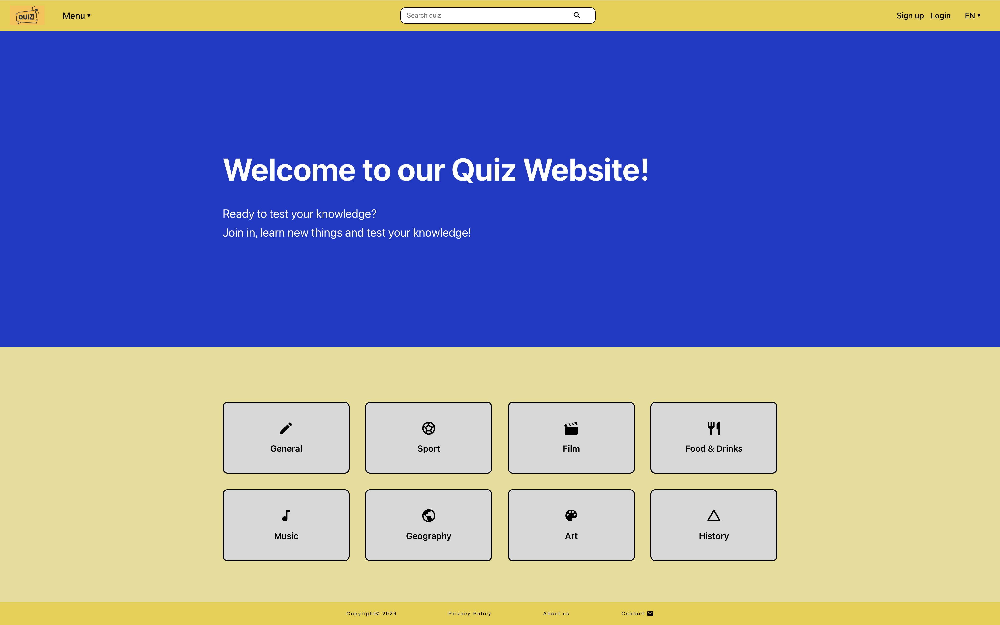
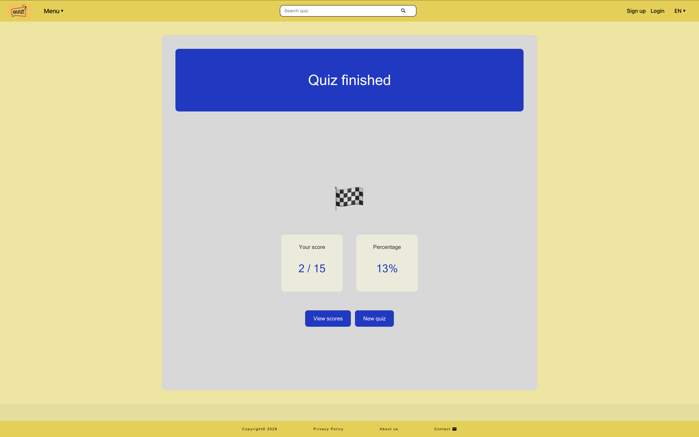
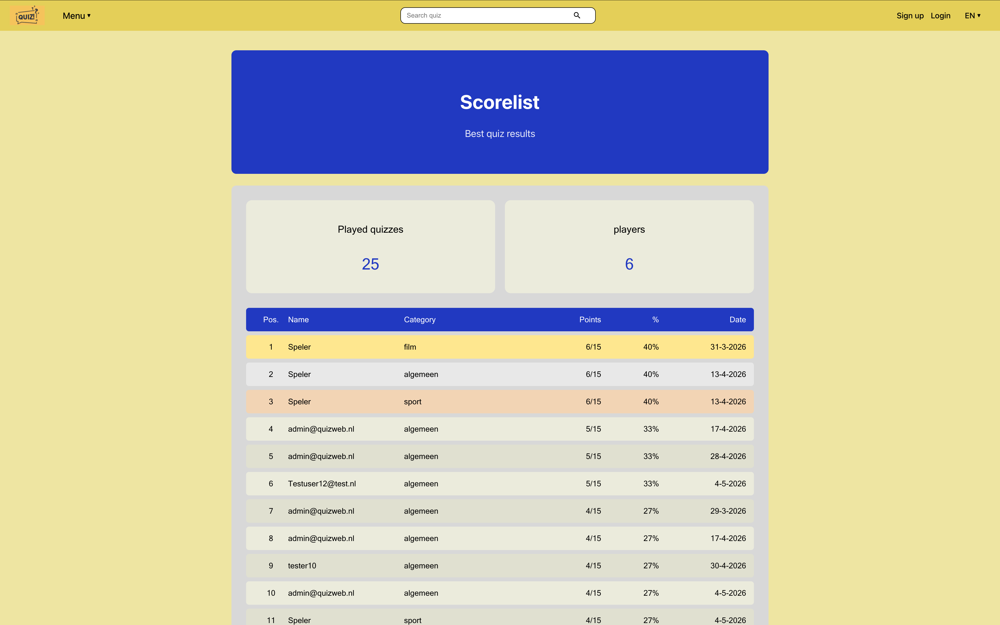

## Quizweb – Interactive Quiz App

Interactieve quiz website gebouwd met React & Vite  
Interactive quiz website built with React & Vite

---

# Inhoudsopgave

1. [Inleiding](#inleiding)
2. [Screenshots](#screenshots)
3. [Functionaliteiten](#functionaliteiten)
4. [Technologieen en frameworks](#technologieen-en-frameworks)
5. [Voorwaarden vooraf](#voorwaarden-vooraf)
6. [Installatie](#installatie)
7. [Inloggegevens](#inloggegevens)
8. [Beschikbare scripts](#beschikbare-scripts)
9. [Projectstructuur](#projectstructuur)
10. [Belangrijke informatie](#belangrijke-informatie)
11. [Licentie](#licentie)

---

# Inleiding

Quizweb is een interactieve quizwebsite waar gebruikers hun kennis kunnen testen in verschillende categorieën zoals Algemeen, Sport, Film, Muziek, Geografie, Kunst en Geschiedenis.

De applicatie is ontwikkeld als eindopdracht voor de Frontend opleiding bij NOVI Hogeschool.

## Belangrijkste functionaliteiten

- Quiz spelen in verschillende categorieën
- Timer per vraag
- Scorelijst met ranking
- Registreren en inloggen
- Admin dashboard
- Meertalige ondersteuning (Nederlands / Engels)
- Responsive design voor mobiel, tablet en desktop
- Contactformulier voor gebruikersfeedback

---

# Screenshots

## Home



## Quiz


## Quiz Finish



## Scorelijst



---

# Functionaliteiten

- Quizzen spelen in meerdere categorieën
- Timer systeem per vraag
- Willekeurige antwoordvolgorde
- Score opslaan
- Scorelijst met topresultaten
- Registreren en inloggen
- Admin dashboard voor beheer van:
  - gebruikers
  - scores
  - contactberichten
- Contactformulier
- Taalwisseling tussen Nederlands en Engels
- Responsive design voor:
  - mobiel
  - tablet
  - desktop

---

# Technologieen en frameworks

| Technologie | Doel |
|---|---|
| React | Frontend UI library |
| Vite | Build tool en development server |
| React Router DOM | Routing en navigatie |
| Context API | State management |
| Iconify | Iconen |
| CSS Flexbox | Responsive layouts |
| Open Trivia API | Quizvragen ophalen |
| NOVI Dynamic API | Opslaan van gebruikers, scores en berichten |

---

# Voorwaarden vooraf

Zorg dat de volgende software geïnstalleerd is:

- Node.js (versie 18 of hoger)
- npm
- Git

Controleer installatie:

```bash
node -v
npm -v
```

---

# Installatie

Volg onderstaande stappen om het project lokaal op te zetten en uit te voeren.

## Methode 1 — Via Git clone

### 1. Clone de repository

Open een terminal en voer uit:

```bash
git clone https://github.com/I-Tosun/quizweb.git
```

### 2. Open de projectmap

```bash
cd quizweb
```

## Methode 2 - Via ZIP bestand

### 1. Download het project als zip

### 2. Pak het ZIP-bestand uit

### 3. Open een terminal in de projectmap

```bash
cd quizweb
```

## 3. Installeer dependencies

```bash
npm install
```

## 4. Enviroment variables instellen

In de root van het project staat een bestand genaamd:

```text
.env.example
```
Maak hiervan een nieuwe bestand:
```text
.env
```


## 5. Start de Applicatie

```bash
npm run dev
```
Na het opstarten verschijnt een lokale URL in de terminal


## 6. Start de applicatie

Open in de browser:

```text
http://localhost:5173
```

---

# Inloggegevens

## Admin account

| Email             | Wachtwoord |
| ----------------- | ---------- |
| admin@quizweb.nl  | admin123   |

Via het admin account is het admin dashboard beschikbaar.

## User account

Gebruikers kunnen zelf registreren via de registratiepagina en daarna direct inloggen.

---

# Beschikbare scripts

| Commando        | Beschrijving             |
| --------------- | ------------------------ |
| npm run dev     | Start development server |
| npm run build   | Maakt productie build    |
| npm run preview | Preview productie build  |
| npm run test    | Voert tests uit          |

---

# Projectstructuur

```text
src/
├── assets/
├── styles/
│   ├── buttons/
│   └── ui/
├── components/
│   ├── buttons/
│   └── ui/
├── context/
├── helpers/
├── layout/
├── pages/
│   └── admin/
├── services/
├── tests/
└── App.jsx
```

---

# Belangrijke informatie

* De NOVI Dynamic API database kan periodiek worden geleegd.
* Bij een lege database moeten gebruikers zich opnieuw registreren.
* Tijdens development kan de API tijdelijk offline zijn.
* De applicatie is getest op:

  * desktop
  * tablet
  * iPhone SE
  * iPhone Pro Max

---

# Licentie

Dit project is ontwikkeld als eindopdracht voor NOVI Hogeschool en is uitsluitend bedoeld voor educatieve doeleinden.